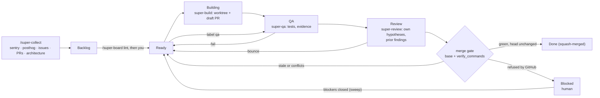

# super-board: how it works

> **What it does not do:** super-board installs skills, scripts, a workflow and guard hooks,
> and onboard sets up your GitHub Project. It does not grant `gh` access on its own, add CI, or approve merges you
> have not allowed. It is not a CI replacement: workers push branches and your CI still runs.
> It is not a free pass on review: set `human_approves_merge: true` to keep a person on every
> merge. It is not for cards without acceptance criteria: QA grades against them.

super-board watches a GitHub Project and runs Build → QA → Review for each card, merging when
the evidence holds. The board is the only state: every agent re-reads it, so a run survives
Ctrl-C, restarts and rate-limit pauses, and `/super-board run <slug>` resumes from whatever
column each card is in.

| | |
|---|---|
| **What you get** | Merged PRs with evidence: screenshots, test reruns, review findings on the PR |
| **How you start** | `/super-board run <slug>`, then drag cards into `Ready` |
| **What holds state** | The board. Cards pick up from their column after any stop |
| **Backend** | In-session dynamic workflow waves by default; headless `claude -p` on opt-in |

## Workflow at a glance



The diagram shows the routes a card can take, not guarantees. A lane that cannot finish writes
the Block template and parks the card for a person; `human_approves_merge: true` replaces the
merge with a hand-off; a card labelled `qa` skips Building.

## Onboarding

`/super-board onboard` is an 8-step wizard. Each step opens with a numbered agenda strip and
`N of 8 · <emoji> <Name> — <why>`, then one question with the recommended answer first.

| # | Step | What happens |
|---|---|---|
| 1 | 🔍 Checks | Fixes every must-have with no question — skills, scripts, workflows, guard hooks, settings entries, old folders (super-refine, cleanup-wt, arch-loop), config keys, labels, columns — and lists them under "Fixed for you". Asks only to install a system tool (the exact brew / apt / winget command) or sign in, then re-checks until green. An older super-board is upgraded here ("Upgraded for you"). |
| 2 | 🔑 GitHub | Signs in and adds board access (`gh auth refresh -s project,read:project,repo`) only when missing; offers to create the repo. |
| 3 | 🗂️ Board | Ranks your GitHub Projects by matching columns and recommends reusing the best (adds what is missing, keeps cards), or creates one with a name taken from package.json / README. |
| 4 | 🌿 Branch | Finds branches and the deploy source; no staging → "Create staging from main" (Recommended). |
| 5 | 📜 AGENTS.md | "Move your N CLAUDE.md rules into AGENTS.md?" — one short question per conflict, nothing lost (coverage-checked). |
| 6 | 🛡️ Policies | Two questions: safe defaults (merge rule, push guard, migrations), and the permission lines. |
| 7 | 📥 Bug sources | Sentry, PostHog, GitHub issues, past PRs, architecture, plus "➕ Add another source": a link, app, API URL, MCP server or command, pinged read-only before it is saved. |
| 8 | ✅ Review | One compact table, then "Write everything?" — files change once, here. |

Stop at any step: the answers are saved, and the next run shows them and continues. Testing a
live site with no repo is not a board: `/super-qa <url>`. The full screen-by-screen contract is
`skills/super-board/references/onboard.md`; the deterministic half is
`scripts/super-board-setup.py`.

**Labels.** Every board has the same seven columns. Three labels route a card: `qa` goes Ready →
QA → Review → Done (test what exists), `bug` and `feature` go through Building first, and a card
with no label is built (the classifier adds `feature` or `bug`). There is no Skipped column: a
card dropped on purpose is closed as not planned and moved to Done with a 🤷 comment.

## Setup notes

- Needs Claude Code, `gh` (authenticated for the board's owner), `jq`, bash 3.2+ and Python 3.
- Or install from a checkout: `./install.sh [--no-hooks] [--protect-main] /path/to/your-project`.
- The board is a GitHub Project (v2) with a `Status` field: `Backlog, Ready, Building, QA, Review, Blocked, Done`. `onboard` reuses your best-matching board (adding what is missing, keeping every card) or creates one.
- Three labels route cards: `qa` skips Building (test what exists), `bug` and `feature` are built first; no label is built too.
- Default backend is in-session dynamic workflows: turn them on in `/config`. Headless `claude -p` is opt-in (`worker_backend: "claude-p"`).
- Set `verify_commands` in the config. Without them the merge gate cannot prove the result builds, and says so.
- `onboard` fixes what the board needs without asking (skills, scripts, workflows, guards, settings, old folders, config keys) and asks only to install a system tool or sign in. An older super-board is upgraded in place (see [Upgrading from 2.x](../../RELEASE-NOTES.md#upgrading-from-2x)).
- `onboard` asks once what the robot may do: auto-merge normal changes up to 400 changed lines (money, auth, destructive schema like DROP/TRUNCATE/RENAME, and bigger PRs wait for you; additive migrations run only on the databases you allow, never live), protect main, and which databases it may migrate (default test + staging). Anything only you may run lands in Blocked tagged 🙋 with the exact command; comment `done` and the next wave merges.
- Auto-merge needs the merge-gate and `gh pr merge` lines in your allowlist; `onboard` offers them as a diff.
- `onboard` can make AGENTS.md the source of truth (CLAUDE.md becomes `@AGENTS.md`) and keeps a managed super-board section in it. Plugin install: the command is `/super-board:super-board onboard`, and its 🔍 Checks step installs the missing scripts, workflows and hooks.
- Bug sources take any extra source in onboard — a link, app name, API URL, MCP server or command — proven readable (read-only) before it is saved; `/super-collect` runs it like the built-ins.
- Testing a live site with no repo is not a board: `/super-qa <url>` runs on its own.
- To enable the usage check, add `printf '%s' "$input" | bash <repo>/.claude/bin/super-board-usage.sh record` to your status-line script.
- Cards need acceptance criteria: QA grades against them, and `lint` tells you which are missing.

## Skills

| Skill | Use it for |
| --- | --- |
| `/super-board` | Orchestrator. Validates preconditions, plans waves, launches them. Holds no product context, writes no code. |
| `/super-build` | `Ready` → `QA`. Worktree, smallest safe change, draft PR. |
| `/super-qa` | `QA` → `Review`. Tests per AC, test-gap check, screenshots/logs/HARs on the PR, or a bounce with a rebuild label. Off-ticket findings file as `source:qa` cards. |
| `/super-review` | `Review` → `Done`. Re-runs the Tester's tests, adversarial truth-check, merges through the gate or hands to a human. On a re-review it first checks every finding from its last report. Shape problems are filed to `Backlog`, never blocked on. |
| `/super-collect` | Filling `Backlog` from Sentry, PostHog, unboarded issues, recurring PR problems and architecture findings, each checked by one verifier first. |
| `/ui-refine-loop` | Polishing one page or component, standalone: Impeccable check → fix rounds ending in a draft PR. The board never runs it. |
| `/visual` | Secondary helper: a visual recap or plan. Merged-worktree cleanup is a hook (`hooks/cleanup-wt.py`): the merge gate runs it after each merge and SessionStart runs it when a base moved. |

## Backends

Lane lifecycles are identical in both.

| | `workflow` (default since 1.6.0) | `claude-p` (opt-in) |
|---|---|---|
| Runs as | in-session dynamic workflow waves | headless `claude -p` workers |
| Needs | dynamic workflows on in `/config` | nothing extra |
| Reference | `skills/super-board/references/run-workflow.md` | `scripts/super-board-run.sh` |

The legacy dispatcher refuses to run (exit 78) unless the config sets it.

**Stop and resume.** `/super-board stop` posts a "stopped mid-flight" comment on every in-flight
issue and PR (lane, last commit, resume hint), releases the assignee mutex, and kills workers and
the dispatcher. Resume with `/super-board run <slug>`. A card stranded in `Building` by a stopped
wave goes back to `Ready`; its branch is kept and the next Builder continues on it.

## How a wave runs

**Waves are sized by your dependency graph, not by a worker count.** Before each wave the planner
reads every card's `## Blocked by` section and dispatches every Ready card whose blockers have all
closed: 3 on a chained board, 19 on a wide one. It also **sweeps `Blocked`**: a card parked on an
issue that has since closed comes back to `Ready` on its own. A dependency line it cannot read
confidently is never treated as free; it is flagged for a human.

**Usage guard.** Before each wave the orchestrator runs `super-board-usage.sh check`. At or over
`usage_pause_pct` (default 95) of the 5-hour or weekly window it launches no new wave, lets the
running one finish and posts a resume note. It needs the status line to record usage (pack README
→ Setup notes), works on Pro/Max only, and an unknown reading never halts a run.

**Nothing merges on GitHub's word.** `mergeable: CLEAN` only means the text does not conflict. The
merge gate takes a lock, checks the PR head is still the commit the Reviewer reviewed, merges the
current base into a scratch worktree, runs your `verify_commands`, and only then squash-merges with
`--match-head-commit`. A branch that stopped compiling while it waited goes back to Build for a
rebase pass; a push after review voids the evidence and the card gets a fresh review.

### Which skills each lane loads

Every lane skill is scoped to the diff or the ticket in front of it. Nothing in a lane may ask the
user a question: the run is unattended, and a skill that waits is a skill that hangs.

| Lane | Loads |
|---|---|
| **super-build** | Routed by the ticket's type label: `bug` → `diagnosing-bugs`+`tdd`, `feature` → `implement`+`tdd`+`codebase-design`, `refactor`/`tech-debt` → `codebase-design`+`tdd`, `docs` → skip `tdd`. Always `ponytail:ponytail` first (inline ladder if absent), `verification-before-completion`, and `code-review` on its own diff. Official docs first for third-party APIs, upgrades, auth/billing. Mechanics (`vitest` / `playwright-best-practices` / `testing-strategy`) by the localisation ladder, never by label. |
| **super-qa** | `ask-matt` · `tdd` · `diagnosing-bugs` · the same testing skills |
| **super-review** | `code-review` (Standards + Spec, merge-base as fixed point) · `codebase-design` · `ponytail:ponytail-review` |

Assignment happens when the ticket is written, not at runtime: super-build routes on the issue's
**type label**, the same `bug` / `feature` / `ux` / `tests` / `docs` / `tech-debt` labels super-qa
files, plus `refactor` from super-review. A `Skills:` line in a ticket body replaces its label's row.

**Interactive-only, never in a lane:** `grilling`, `shape`, `clarify` and
`improve-codebase-architecture`. They prompt, wait or open a browser. They belong to
`super-board lint` and to you at a keyboard. A worker that wants one is telling you the ticket
needed a human before the loop started.

## The six agentic patterns, mapped

```
  workflows/super-board-wave.js   the conductor: owns the patterns
  skills/super-{build,qa,review}  the sheet music: one lane agent each
  the prompt it spawns            "Run super-build on #N, follow run.md exactly"
```

| Pattern | When |
|---|---|
| **Routing** | `Ready` cards only: a cheap classify agent (haiku; sonnet on `--high`) picks the model tier per card |
| **Prompt chaining** | Every card: each lane runs only if the previous returned `advanced` |
| **Parallelization** | Always: card A can be in Review while card B builds |
| **Evaluator–optimizer** | QA/Review judge the Builder's work; a fail bounces the card and the next wave rebuilds with the comments as context |
| **Orchestrator–workers** | Every wave: your session never codes; lane agents do all product work |
| **Autonomous loop** | The wave loop repeats until the board is drained or a halt gate fires |

A wave of three cards:

```
 ORCHESTRATOR (your session)            ← orchestrator–workers
   │ plan wave → claim → launch
   ▼
 #47: classify → build → qa → review    ┐
 #51:            qa → review            ├ parallelization (cards overlap)
 #52: classify → build ✗ (bounced)      ┘   chain stops; the board keeps the card
                           │
 merge gate: ──[lock]── one merge at a time
```

Merges are serialised by the merge gate's lock alone; reading diffs and re-running suites in
Review run in parallel.

## Safety controls

**Worker storms**, 30 `Ready` cards starting 30 Builders, were the failure that bit early users of
the headless backend. On `claude-p`, six gates stand in the way before any spawn:

```
  1  orphan scan ........... workers alive from a crashed run?  → refuse to start
  2  in-flight lockfile .... .claude/super-board/inflight/<N>   → skip (survives restart)
  3  assignee claim ........ atomic, BEFORE spawn               → skip (closes the cold-start race)
  4  worker cap ............ max_workers (default 3)            → wait
  5  GraphQL quota <200 .... sleep until reset                  → wait
  6  tick not elapsed? ..... tick_seconds, 120s floor           → wait
```

The 120-second tick holds ProjectsV2 query cost (~103 GraphQL points per tick) to about 3.1k/hr
against a 5k budget; raise `tick_seconds` if you have headroom. The workflow backend has its own
equivalents: a wave lock that keeps the two backends from running at once, assignee claims, a
crash-recovery sweep of leaked assignees, the rate guard and the usage guard
(`references/run-workflow.md`).

Guard hooks, installed by `install.sh` unless `--no-hooks`: worktrees only under
`.claude/worktrees/`, no reading of secret files, no API keys written into source, no deleting
outside the project, and merged-worktree cleanup at session start. Blocking direct and force pushes
to the base branch is opt-in (`onboard` asks once, or `install.sh --protect-main`). See
`hooks/README.md`.

**Who merges, and which databases the robot touches** (v2.6.0, config `merge_policy` and
`migrations`, enforced inside the merge gate):

```
  PR is …                                      gate        card
  ─────────────────────────────────────────    ────────    ─────────────────────────────
  a normal change, verify green                merge (0)   Done
  money / auth / destructive schema (labels,   exit 7      Blocked 🙋 — you merge it, or
    path globs, added-line keywords), or                   comment `done` to approve
    over auto_max_lines (default 400 changed
    lines: "big PR — please review")
  additive migrations, target env allowed      migrate,    Done
                                               merge (0)
  migrations for live (not allowed), a failed  exit 8      Blocked 🙋 — exact commands;
    migrate command, a `needs-you:` step                   comment `done` → next wave merges
```

In plain words: only **destructive** schema changes (DROP / TRUNCATE / RENAME, or a `schema`
label) need a human. Additive migrations (a new table, column or index) follow the database rule:
the robot runs them on the databases you allowed. A live database is always yours.

## Configuration

Minimal config at `.claude/super-board/configs/<slug>.json`:

```json
{
  "worker_backend": "workflow",
  "project": { "owner": "your-gh-login-or-org", "number": 12 },
  "base_branch": "main",
  "human_approves_merge": false,
  "verify_commands": ["npm ci --silent && npm run typecheck && npm test"],
  "rebuild_cap": 2,
  "notifications": { "bot_identity": "your-bot-login" }
}
```

```
  worker_backend        workflow | claude-p
  columns               Backlog · Ready · Building · QA · Review · Blocked · Done (always all seven)
  human_approves_merge  legacy: true = never auto-merge (prefer merge_policy.default "human")
  merge_policy          default auto|human · auto_max_lines (400) · size_exclude · always_human {money, auth, schema}
  migrations            globs · allowed_envs (test, staging, live) · target_env · commands
  verify_commands       run by the merge gate against the current base before every merge
  rebuild_cap           bounces allowed before a card goes Blocked
  max_workers           optional wave throttle; absent or 0 = unlimited (claude-p defaults to 3)
  tick_seconds          claude-p GraphQL budget floor, default 120
  usage_pause_pct       pause new waves at this % of the Claude usage window, default 95
  refine, collect       optional blocks for ui-refine-loop and super-collect (collect.custom = extra sources)
```

```
  label           lanes
  ─────────       ─────────────────────────────────────
  feature, bug,   Ready → Building → QA → Review → Done
  none
  qa                     Ready → QA → Review → Done
                         └ hardening code that already exists
```

Every key, with notes: `skills/super-board/references/config-schema.json`.

## How workers decide what test to write

Three layers, three questions. None substitutes for another.

```
  tdd          →  how do I write a test worth having?     discipline
  the ladder   →  which layer does the defect live at?    placement
  vitest |        how do I express it in this repo?       mechanics
  playwright
```

**The middle one is what everyone skips.** A Tester finds every bug through a browser. Where you
*observed* a bug says nothing about where it *lives*. Walk down from the browser and stop at the
first rung that still reproduces:

```
  1  call the module directly       unit         Vitest
  2  wire the real collaborators    integration  Vitest
  3  drive a real browser           e2e          Playwright
  4  needs a live third party       NOT a test   file a gap
```

An e2e pinning a pure-logic defect is slower, flakier, and goes red pointing at a page instead of a
function. Every test must be **red for the right reason** (run against unfixed code; a timeout or
missing selector means you pinned the harness) and **refactor-survivable**. `testing-strategy`
informs coverage, not placement. Contract testing stays out of the default set: Pact solves drift
between independently deployed services, which a single-app repo does not have.

## Start with low autonomy

- Run `/super-board lint` first and fix what it flags.
- Start with `human_approves_merge: true` and a few cards; read the PR comments each lane leaves.
- Set `verify_commands` before you allow auto-merge, and add `Bash(gh pr merge:*)` to the
  allowlist only when you mean it: it removes the last human gate.
- Label a few cards `qa` on code that already exists before letting Builders loose.
- Run `/super-collect` in its default dry-run before `--yes`.

Missing, unreadable or stale evidence is a hold for a person, never a pass.

## Limits

- `gh` auth and CI come from you. Onboard reuses or creates the board and its columns and labels; it never signs in or installs a system tool without your OK.
- The workflow backend needs dynamic workflows enabled in Claude Code.
- The usage guard reads only what an interactive status line recorded; headless runs see no usage.
- `verify_commands` are only as good as your test suite. Without them the gate says it proved nothing.
- Lanes call [mattpocock/skills](https://github.com/mattpocock/skills) by name; without that pack a worker fails when it reaches for one.
- `bash` 3.2+ (stock macOS is fine), `jq` and Python 3 are required on the machine running the loop.

## Pack layout and tests

```
  skills/<name>/   SKILL.md (agent prompt) · README.md · references/ · scripts/
  workflows/       super-board-wave.js, ui-refine-loop.js
  scripts/         dispatcher, planner, merge gate, usage check, filers, README sync
  hooks/           guard hooks, cleanup-wt, settings snippets; dev/ = skill-eval gate (never installed)
  tests/           bash/python tests, no network: bash tests/test-*.sh
  evals/           behavioural evals for `claude plugin eval` (evals/README.md)
```

The minimal `.claude-plugin/plugin.json` exists so `claude plugin eval` can load the pack;
`install.sh` stays the install path. The full lane-to-skill mapping, including the skills kept
because Matt's pack has no equivalent, is in `skills/super-build/references/decision-policy.md`.
